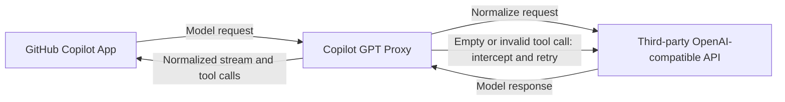

# Copilot GPT Proxy

[简体中文](README.md) | English

`copilot-gpt-proxy` is a local OpenAI-compatible proxy for GitHub Copilot App. It lets users access all ChatGPT models through third-party APIs while reducing failures and repeated actions caused by tool-call compatibility issues.

See [DESIGN.md](DESIGN.md) for implementation details, protocol boundaries, and design trade-offs.

## Problem Addressed

### Symptoms

When ChatGPT models perform coding tasks through GitHub Copilot App, the model may repeatedly say that it is about to edit a file without completing the tool call. A common error is:

```text
apply_patch requires a non-empty string input (the patch content).
```

The response stream may also terminate early, after which retries fall into the same loop.

### Cause

`apply_patch` expects raw patch text as free-form input. Copilot's agent adapter, a third-party API, and the underlying tool executor may interpret that tool differently. If an intermediate layer converts, wraps, escapes, truncates, or drops the free-form input, the model emits empty or invalid arguments. The executor rejects the call while the model retries against the same tool description, creating a loop. This is a tool-protocol compatibility issue, not an inability of the model to write a patch.

## How It Works

The proxy sits between Copilot App and the third-party API, normalizes requests and responses, intercepts invalid tool calls before they reach Copilot's executor, and forwards an executable result only after a bounded retry.



## Installation

Python 3.10+ and [uv](https://docs.astral.sh/uv/) are required.

```powershell
git clone git@github.com:Angela459/copilot-gpt-proxy.git
cd copilot-gpt-proxy
uv sync
```

## Manual Configuration

Make a copy of `config.example.yaml` and rename the copy to `config.yaml`.

Open `config.yaml` and configure providers and model routes:

```yaml
model: "gpt-5.4"

providers:
  OpenAI:
    base_url: "https://api.openai.com/v1"
  # OpenRouter:
  #   base_url: "https://openrouter.ai/api/v1"

models:
  OpenAI:
    - "gpt-5.4"
    # - "gpt-5.4-mini"
    # - "gpt-4.1"
  # OpenRouter:
  #   - "openai/gpt-5.4"
  #   - "anthropic/claude-sonnet-4"
```

Under `providers`, enter each provider name and its `base_url`. Under `models`, group model names by the same provider names. A model name is used both as Copilot's model ID and the upstream model ID, so the same model name cannot appear under multiple providers.

Configure the API key only in GitHub Copilot App. The proxy does not read API keys from `config.yaml` or environment variables, nor does it store or switch keys. It only forwards the Authorization value from Copilot's current request to the selected provider.

### Configuration Reference

| Setting | Values or format | Purpose |
| --- | --- | --- |
| `model` | An enabled model under `models` | Default model when a request does not specify one. |
| `providers` | Mapping of provider names to settings | Defines every provider available to the proxy. Names are user-defined and referenced by `models`. |
| `providers.<name>.base_url` | API URL beginning with `http://` or `https://` | Original OpenAI-compatible API base URL, usually ending in `/v1`. |
| `models` | Mapping of provider names to model lists | Defines models available through each provider. Group names must exactly match names under `providers`. |
| `models.<Provider>` | List of model names | Each name is used as both the Copilot model ID and upstream model ID. |
| `thinking` | `enabled` / `disabled` | Enables upstream reasoning mode. |
| `reasoning_effort` | `low` / `medium` / `high` / `max` / `xhigh` | Selects reasoning effort; the proxy maps it to a level supported upstream. |
| `display_reasoning` | `true` / `false` | Shows reasoning content in Copilot output. |
| `collapsible_reasoning` | `true` / `false` | Displays reasoning in a collapsible section when reasoning is visible. |
| `host` | IP address | Local listen address. The default `127.0.0.1` is accessible only from this machine. |
| `port` | Port number | Local listen port; default is `9000`. |
| `verbose` | `true` / `false` | Enables detailed logging; prompts and code may appear in the terminal. |
| `request_timeout` | Seconds | Timeout for upstream API requests. |
| `max_request_body_bytes` | Bytes | Maximum accepted Copilot request-body size. |
| `cors` | `true` / `false` | Sends permissive CORS response headers. |
| `empty_apply_patch` | `retry_once` / `reject` / `allow` | Retries an empty `apply_patch` once, rejects it, or forwards it unchanged. |
| `max_tool_retries` | `0` / `1` | Maximum retries for invalid tool calls; currently capped at 1. |

The config file must not contain `api_key` or `api_key_env`. To use a provider requiring a different key, first update the API key in Copilot App.

Start the proxy:

```powershell
uv run copilot-gpt-proxy
```

The terminal prints the proxy URL after startup:

```text
api_base_url: http://127.0.0.1:9000/v1
```

### Configure Copilot App (required)

**In the third-party API settings of GitHub Copilot App, manually change API Base URL to the displayed `api_base_url`:**

```text
http://127.0.0.1:9000/v1
```

Continue to enter the API key in Copilot App. Use an enabled model name under `models` in `config.yaml`.

The proxy is independent of the code directory opened in Copilot, but it must remain running while Copilot sends requests.

## Acknowledgements

The project concept and parts of the code are based on [yxlao/deepseek-cursor-proxy](https://github.com/yxlao/deepseek-cursor-proxy). Thanks to the original author for their work.
