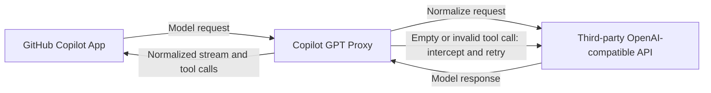

# Copilot GPT Proxy

[简体中文](README.md) | English

`copilot-gpt-proxy` is a local OpenAI-compatible proxy for GitHub Copilot App. It lets users access all ChatGPT models through third-party APIs while reducing failures and repeated actions caused by tool-call compatibility issues.

See [DESIGN.md](DESIGN.md) for implementation details, protocol boundaries, and design trade-offs.

## Problem Addressed

### Symptoms

When ChatGPT models perform coding tasks through GitHub Copilot App, the model may repeatedly say that it is about to edit a file without completing the tool call. A common error is:

```text
apply_patch requires a non-empty string input (the patch content).
```

The response stream may also terminate early, after which retries fall into the same loop.

### Cause

`apply_patch` expects raw patch text as free-form input. Copilot's agent adapter, a third-party API, and the underlying tool executor may interpret that tool differently. If an intermediate layer converts, wraps, escapes, truncates, or drops the free-form input, the model emits empty or invalid arguments. The executor rejects the call while the model retries against the same tool description, creating a loop. This is a tool-protocol compatibility issue, not an inability of the model to write a patch.

## How It Works

The proxy sits between Copilot App and the third-party API, normalizes requests and responses, intercepts invalid tool calls before they reach Copilot's executor, and forwards an executable result only after a bounded retry.



## Installation

Python 3.10+ and [uv](https://docs.astral.sh/uv/) are required.

```powershell
git clone git@github.com:Angela459/copilot-gpt-proxy.git
cd copilot-gpt-proxy
uv sync
```

## Manual Configuration

Make a copy of `config.example.yaml` and rename the copy to `config.yaml`.

Open `config.yaml` and configure providers and model routes:

```yaml
model: "gpt-5.4"

providers:
  primary:
    base_url: "https://your-provider.example/v1"

models:
  gpt-5.4:
    provider: primary
    model: "gpt-5.4"
  gpt-5.4-mini:
    provider: primary
    model: "gpt-5.4-mini"
```

The top-level `model` is the default model alias. Names under `models` are the model IDs used by Copilot, while the nested `model` is the real model name sent to that provider. One proxy process can route multiple providers and models.

If providers use different API keys, configure an environment variable name for each provider:

```yaml
providers:
  backup:
    base_url: "https://another-provider.example/v1"
    api_key_env: "BACKUP_PROVIDER_API_KEY"
```

Set the environment variable before startup:

```powershell
$env:BACKUP_PROVIDER_API_KEY = "your-api-key"
```

Providers without `api_key_env` continue to use the API key configured in Copilot App.

Start the proxy:

```powershell
uv run copilot-gpt-proxy
```

The terminal prints the proxy URL after startup:

```text
api_base_url: http://127.0.0.1:9000/v1
```

In the third-party API settings of GitHub Copilot App, manually change API Base URL to the displayed `api_base_url`. Use one of the names defined under `models` in `config.yaml` as the model.

The proxy is independent of the code directory opened in Copilot, but it must remain running while Copilot sends requests.

## Acknowledgements

The project concept and parts of the code are based on [yxlao/deepseek-cursor-proxy](https://github.com/yxlao/deepseek-cursor-proxy). Thanks to the original author for their work.
