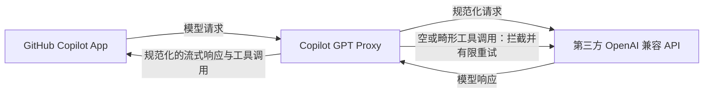

# Copilot GPT Proxy

简体中文 | [English](README.en.md)

`copilot-gpt-proxy` 是一个供 GitHub Copilot App 使用的本地 OpenAI 兼容代理，让用户可以通过第三方 API 使用 ChatGPT 的所有模型，并减少工具调用兼容问题造成的失败或重复执行。

实现原理、协议边界和设计取舍见 [DESIGN.md](DESIGN.md)。

## 解决的问题

### 现象

通过 GitHub Copilot App 使用 ChatGPT 模型执行代码任务时，模型可能反复表示“现在开始修改”，却没有真正完成工具调用；终端随后出现 `apply_patch requires a non-empty string input`、流式响应提前结束等错误，并在重试后再次进入相同循环。

### 原因

[`apply_patch` 工具调用格式分析](https://zhuanlan.zhihu.com/p/2040102122830697685)指出，`apply_patch` 本应接收原始补丁文本（freeform），但 Copilot 的 Agent 适配层、第三方 API 和底层工具执行器对工具格式的理解可能不一致。freeform 语义在中间链路中被 JSON 化、包装、转义、截断或丢失后，模型会生成空参数或格式错误的调用；执行器拒绝调用，而模型仍依据相同的工具描述继续重试，于是形成循环。这是工具协议兼容问题，不是模型不会编写补丁。

## 工作原理

一句话：本项目位于 Copilot App 与第三方 API 之间，规范化请求和响应，并在畸形工具调用到达 Copilot 执行器前拦截它，有限重试后只转发可执行的结果。



## 安装

需要 Python 3.10+ 和 [uv](https://docs.astral.sh/uv/)。

```powershell
git clone git@github.com:Angela459/copilot-gpt-proxy.git
cd copilot-gpt-proxy
uv sync
```

## 手动配置

复制一份 `config.example.yaml`，并将副本重命名为 `config.yaml`。

打开 `config.yaml`，填写第三方 API 的原始地址和模型：

```yaml
base_url: "https://your-provider.example/v1"
model: "gpt-5.4"
```

启动代理：

```powershell
uv run copilot-gpt-proxy
```

代理启动后，终端会显示：

```text
api_base_url: http://127.0.0.1:9000/v1
```

在 GitHub Copilot App 的第三方 API 配置中，将 API Base URL 手动改为终端显示的 `api_base_url`。API Key 保持原值，模型应与 `config.yaml` 中的 `model` 一致。

代理与 Copilot 打开的代码目录无关，但 Copilot 发出请求时代理必须保持运行。

## 致谢

项目思路与部分代码来自 [yxlao/deepseek-cursor-proxy](https://github.com/yxlao/deepseek-cursor-proxy)，感谢原项目作者的工作。
